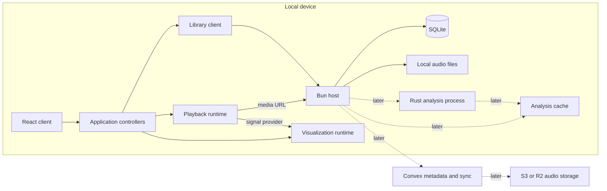

# Architecture

> Status: Living design document; Task 1 is implemented and verified.
>
> Planning source: Codex task `019f5f0f-9558-7ce0-b667-92d79994d3fd`, discussed July 13-15, 2026.
>
> Last updated: July 15, 2026.

## Recommendation

Build the first version as a local-first modular monolith:

- one isolated repository at `~/dev/apps/wave-player-next`;
- one Bun process bound to `localhost`;
- one React client;
- one SQLite database;
- audio files indexed in place;
- browser-native media playback;
- an independent visualization runtime;
- no cloud dependency;
- no physical package split until a second consumer exists.

This shape is small enough to build and operate as one project while keeping the behavioral boundaries required for later Rust, Convex, GPUI, and KKB work.

## TypeScript 7 toolchain

Use TypeScript 7 as the primary CLI type-checker and language-service generation for the first repository. Keep the application independent of the compiler's programmatic API: TypeScript 7.0 does not expose one, and tools that require it may need the TypeScript 6 compatibility package side-by-side.

Initial toolchain rules:

- pin exact TypeScript, Bun, React, and type-package versions in the lockfile;
- use TypeScript 7's native `tsc` for the repository type-check command;
- explicitly include Bun in `compilerOptions.types`, because TypeScript 7 retains the empty-by-default type-package discovery behavior introduced in TypeScript 6;
- use strict settings and preserve the newer module-resolution defaults intentionally;
- verify each compiler-integrated linting, testing, and editor tool against TypeScript 7 before adopting it;
- add the TypeScript 6 compatibility package only when a chosen tool has a concrete compiler-API requirement.

References:

- [Announcing TypeScript 7.0](https://devblogs.microsoft.com/typescript/announcing-typescript-7-0/)
- [Bun: TypeScript 6 and 7](https://bun.com/docs/typescript-6)

## System context



The dotted edges are later-phase extension points, not initial requirements.

## Initial repository shape

```text
src/
  core/
    library/
    playback/
    visualization/

  app/
    library/
    player/
    visualization/

  server/
    database/
    library/
    media/
    analysis/
    http/

  client/
    app/
    card/
    library/
    player/
    audio/
    visualization/
    settings/
```

Rust arrives later:

```text
crates/
  wave-core/
  wave-tools/
```

The exact leaf files should follow actual behavior. Do not add `index.ts` barrel files by default.

## Meaning of `src/core/`

`src/core/` is the pure product model and invariant layer. The name is appropriate if it remains narrow.

Allowed responsibilities:

- branded or opaque domain identifiers;
- works, tracks, assets, locations, collections, themes, scenes, and presets;
- validation and normalization that do not require external resources;
- pure selection and grouping rules;
- state-machine types and pure transitions where useful;
- narrow ports required by application use cases.

Forbidden responsibilities:

- React components or hooks;
- Bun, SQLite, filesystem, HTTP, browser, DOM, Web Audio, or WebGPU access;
- generic utilities with no product meaning;
- infrastructure configuration;
- a broad `common` or `helpers` dumping ground.

If a type exists only because SQLite, Convex, or a UI library needs it, it does not belong in `core`.

## Meaning of `src/app/`

`src/app/` is the application/use-case and orchestration layer.

It owns:

- library scanning and reconciliation use cases;
- track selection and queue orchestration;
- session restoration and persistence commands;
- composition of catalog, playback, and visualization capabilities;
- user-intent commands and derived snapshots;
- cancellation, command ordering, and lifecycle at the use-case level.

It does not own:

- React rendering;
- SQL queries;
- raw filesystem traversal;
- media element mechanics;
- WebGPU resource management;
- Convex queries or mutations directly.

`src/client/app/` may still hold the React composition root. Its name is scoped under `client` and should not be confused with the use-case layer in `src/app/`.

## Dependency direction

```text
core
  imported by app, server, and client

app
  imports core and depends on narrow ports

server
  implements storage, scan, media, and analysis ports

client
  implements browser playback, signal, and visualization runtime ports;
  composes app, server-facing clients, and React presentation
```

Rules:

1. `core` imports no outer layer.
2. `app` imports no concrete database, HTTP, React, or browser implementation.
3. `server` does not import React.
4. browser audio and visualization adapters do not import catalog persistence or React presentation.
5. playback does not import visualization.
6. visualization consumes a signal-provider contract rather than player internals.
7. React adapters remain thin subscriptions and lifecycle bindings.

## State ownership

| Owner | State |
|---|---|
| SQLite in Task 1 | roots, tracks, assets, local locations, and scene presets |
| SQLite later | works, collections, themes, grouping evidence, and analysis references |
| Bun host memory | open database, active scans, transient filesystem activity, analysis jobs |
| Library controller | library lifecycle, queries, scan commands, selection-facing catalog state |
| Player controller | selected track, queue, restore state, user-intent orchestration |
| Playback runtime | source, status, time, duration, buffering, transport error, diagnostics |
| Visualization session | active scene, renderer, buffers, parameters, interaction state |
| React | transient presentation state only |
| Browser-local persistence | selected track, volume, active card view, and other device-local UI intent |
| Convex later | portable metadata, collections, presets, history, cloud references |
| Object storage later | remote audio and large generated artifacts |

Persist app-level intent, not raw runtime internals.

## Bun host

The Bun host should:

- serve the React application;
- expose narrow library and settings operations;
- own SQLite access and migrations;
- scan approved roots;
- resolve asset IDs to approved local paths;
- stream media with HTTP Range support;
- later coordinate analysis jobs;
- bind explicitly to `localhost`.

Bun supports full-stack React/TypeScript through HTML imports and streams `Bun.file` responses with Range request support. These capabilities make a single local host practical without Next.js or another server framework.

References:

- [Bun HTTP server](https://bun.com/docs/runtime/http/server)
- [Bun routing and file streaming](https://bun.com/docs/runtime/http/routing)
- [Bun SQLite](https://bun.com/docs/runtime/sqlite)

## Local API shape

Use a small typed JSON HTTP API implemented directly with `Bun.serve` routes. Share request and response DTOs where useful, and use Zod at untrusted request and configuration boundaries. Do not introduce tRPC, GraphQL, OpenAPI generation, or another RPC framework in Task 1.

The concrete route names may change during implementation, but the initial capabilities are:

```text
GET  library tracks
GET  library root and scan state
PUT  library root
POST library scan
GET  scene presets
PUT  scene preset
GET  /media/:assetLocationId
```

The media route remains a binary response addressed by a known location ID rather than a JSON endpoint accepting a path.

## Library-root configuration

The first-run card view accepts one absolute directory path. The Bun host:

1. resolves and canonicalizes the path;
2. verifies that it is an accessible directory;
3. persists it as the single active root;
4. exposes the canonical path and scan state to the UI;
5. never treats the configured root as a media request path.

A CLI option may provide a bootstrap or recovery override, but the normal product flow is UI-backed and persists across restarts. A native folder chooser can arrive with a future native shell.

## SQLite migrations

Use ordered SQL files applied by a small transactional migration runner over `bun:sqlite`.

Requirements:

- a `schema_migrations` table records version, name, checksum, and application time;
- each migration applies once inside a transaction;
- checksum mismatches fail loudly;
- integration tests cover a fresh database and every supported upgrade path;
- `0001_initial` contains only Task 1 tables;
- no ORM or general repository framework is introduced.

Expected first tables:

```text
schema_migrations
library_roots
tracks
assets
asset_locations
scene_presets
```

Works, collections, grouping evidence, and analysis artifacts should prove the migration path in later phases rather than appearing as unused Task 1 tables.

## Initial format boundary

Task 1 guarantees WAV and MP3 discovery, MIME handling, playback, Range responses, fixtures, and browser verification.

Ableton Live Project directories and `.als` Live Set files may appear inside scanned trees. They are not playable assets, should not cause scan failures, and are not parsed during Task 1. Phase 2A can use their paths and metadata as evidence for non-destructive Work grouping.

## Filesystem and media security

The browser must never supply an arbitrary path to a media endpoint.

Preferred request flow:

```text
GET /media/:assetLocationId
  -> load known location from SQLite
  -> confirm enabled library root
  -> resolve and normalize path
  -> verify path remains inside root
  -> return Bun.file response
```

The initial application should index files in place. It should not rename, move, delete, retag, or copy user audio.

Start with explicit manual rescans. Add filesystem watching only after scan and reconciliation behavior is correct and tested.

## Main flows

### Import and rescan

```text
configured root
  -> enumerate candidate files
  -> gather file metadata
  -> normalize candidate
  -> match existing location/fingerprint
  -> create or update Track, Asset, and AssetLocation
  -> commit in bounded SQLite transactions
  -> publish refreshed library snapshot
```

### Playback

```text
user selects Track
  -> player controller resolves preferred Asset
  -> media resolver chooses playable AssetLocation
  -> Bun host returns same-origin media URL
  -> playback runtime loads HTMLMediaElement
  -> runtime publishes transport snapshot
```

### Visualization

```text
playback runtime
  -> analysis tap
  -> signal provider
  -> visualization session
  -> scene renderer
  -> WebGPU canvas
```

### Later analysis

```text
asset location
  -> Bun analysis coordinator
  -> wave-tools native process
  -> versioned artifact manifest
  -> Bun validates result
  -> Bun writes SQLite reference
```

Bun should remain the sole SQLite writer during external analysis.

## Package policy

Keep these boundaries as modules in the isolated repository. Create packages only when another application, KKB, a GPUI client, or another real consumer needs the same stable behavior.

A package is not evidence of architecture by itself. The initial repository should avoid:

- a generic `audio-core` package;
- a visualizer plugin SDK;
- separate React adapter packages;
- separate catalog packages;
- a multi-app monorepo;
- microservices or a persistent background daemon.

## Architectural fitness checks

The design remains healthy when:

- core model tests run without Bun, DOM, or React globals;
- app controller tests can use real lightweight adapters or narrow fakes;
- SQLite integration tests use a real temporary database;
- media route tests use a real Bun server and real fixture files;
- playback behavior is testable without React;
- visualization lifecycle is testable without catalog state;
- replacing SQLite with a future catalog client does not change playback or scene code;
- introducing Rust analysis does not create a second catalog writer;
- React components mostly render snapshots and forward commands.

## Non-blocking implementation choices

The exact HTTP route spelling, DTO filenames, SQL formatting, and leaf directories may follow evidence from the generated Bun/shadcn project. They are not permission to change the settled boundaries, initial formats, persistence ownership, or card-centered product shell.
