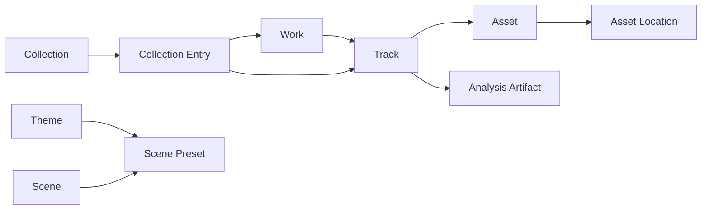

# Core Model

> Status: Living design document; Task 1 implementation is underway.
>
> Planning source: Codex task `019f5f0f-9558-7ce0-b667-92d79994d3fd`, discussed July 13-15, 2026.
>
> Last updated: July 15, 2026.

## Purpose

The core model must represent personal music, evolving Ableton exports, file encodings, and storage locations without collapsing them into one URL-based track record.

The model belongs in `src/core/` and should remain independent of SQLite, Convex, Bun, React, browser APIs, and Rust bindings.

## Entity overview



## `Work`

A `Work` is the durable creative identity of a song, composition, experiment, or project.

Examples:

- Night Drive
- Untitled Ableton sketch from July 2026
- Binaural study in D

A work can group multiple listenable tracks without asserting that those tracks are interchangeable encodings.

Potential fields:

- stable work ID;
- title and optional alternate title;
- artist or creator;
- notes;
- creation and modification timestamps;
- optional Ableton project/set references;
- user-confirmed and imported metadata;
- optional artwork reference.

A work is optional for an imported track. Ungrouped tracks must remain valid first-class library entries.

## `Track`

A `Track` is one listenable recording, mix, master, performance, stem, demo, or other audible version.

Examples:

- Night Drive — mix 08
- Night Drive — master 02
- Night Drive — instrumental stem

Potential fields:

- stable track ID;
- optional work ID;
- title;
- artist;
- album or release metadata;
- version label;
- optional role such as mix, master, stem, demo, live, or reference;
- duration metadata;
- artwork reference;
- provenance and import timestamps.

Runtime duration remains authoritative after media loads. Catalog duration is useful for pre-load display and validation.

## `Asset`

An `Asset` represents a concrete encoding of one track.

Examples:

- 24-bit WAV master;
- MP3 listening export;
- FLAC archival copy;
- AAC listening copy.

Potential fields:

- stable asset ID;
- track ID;
- container and codec;
- MIME type;
- sample rate, channels, and bit depth where known;
- file size;
- checksum or content fingerprint when available;
- encoding or quality label;
- preferred-playback priority.

Different mixes are different tracks, not multiple assets of one track. Different encodings of the same audible version are assets of the same track.

## `AssetLocation`

An `AssetLocation` describes where an asset can be accessed.

Location kinds may eventually include:

- local file path;
- S3 or R2 object;
- Convex storage reference;
- remote HTTP resource;
- provider reference.

Potential fields:

- stable location ID;
- asset ID;
- location kind;
- device or storage provider ID;
- locator data owned by the matching infrastructure adapter;
- availability state;
- last verification timestamp;
- optional byte size and modification metadata.

Local absolute paths are device-local and must not become portable catalog identity.

## `LibraryRoot`

A `LibraryRoot` is an approved local directory the Bun host may scan and serve.

It owns:

- stable root ID;
- normalized absolute path;
- enabled state;
- scan status and timestamps;
- optional display name;
- import policy settings.

The first version should not mutate files under a root.

## `Collection`

A `Collection` is an ordered or unordered grouping such as:

- playlist;
- album or release;
- Ableton project group;
- favorites;
- listening queue snapshot;
- arbitrary folder-like collection.

Collection entries should reference works or tracks by stable IDs, not embed copies of their metadata.

## `AnalysisArtifact`

An `AnalysisArtifact` records the output of a specific analysis algorithm and version.

Potential examples:

- waveform envelope;
- loudness and true peak;
- spectral summary;
- onset candidates;
- beat or tempo candidates;
- Chladni mode field;
- rendered preview image.

Artifact identity must include enough algorithm/version information to invalidate stale results safely.

Large arrays or binary fields may live in cache files or object storage while SQLite or Convex stores their metadata and references.

## `Theme`

A `Theme` controls application presentation:

- color tokens;
- typography;
- surfaces and borders;
- spacing or density choices;
- motion preferences;
- default scene palette hints.

A theme must not contain executable rendering code.

## `Scene` and `ScenePreset`

A `Scene` is a code-defined visualizer implementation with a stable ID, version, parameter schema, lifecycle, and rendering behavior.

A `ScenePreset` is serializable data:

- scene ID and compatible scene version;
- parameter values;
- palette or theme linkage;
- optional input mapping;
- name and metadata.

This separation allows presets to be shared before a general code-plugin system exists.

## Ableton-aware grouping

### Recommended default UX

Import each discovered Ableton export as an independent `Track` by default.

Automatic analysis may produce a `WorkGroupingSuggestion`, but it must not silently merge tracks into a work. Grouping should be:

- non-destructive;
- explainable;
- reversible;
- optional;
- capable of bulk acceptance.

This avoids a poor first-run experience where filename heuristics incorrectly hide or combine recordings.

### Grouping method

The grouping system can inspect:

- normalized filename stems and version suffixes;
- containing directories;
- embedded audio metadata;
- file creation and modification times;
- duration, sample rate, channels, and related technical metadata;
- nearby Ableton Live Project and Live Set metadata when accessible;
- export naming conventions learned from confirmed groupings.

It should produce:

```text
candidate tracks
  -> proposed Work identity
  -> confidence and evidence
  -> user accepts, edits, or ignores
```

An accepted grouping sets or changes the tracks' `workId`; it does not rewrite or merge the audio assets.

### Confidence model

A useful future shape is:

- high confidence: same project metadata plus strong filename/version relationship;
- medium confidence: shared directory and normalized title with compatible timestamps;
- low confidence: filename similarity only.

Only high-confidence suggestions should be visually prominent. None should be auto-applied in the initial implementation.

## File identity and reconciliation

The initial scan needs a cheap location fingerprint such as:

- normalized path;
- file size;
- modification time.

A later background process can compute a content hash for rename detection, deduplication, remote matching, and durable asset identity.

Full hashing should not block the first scan of a large library.

Reconciliation must distinguish:

- an unchanged file;
- metadata changed at the same path;
- a missing local location;
- a new location for an existing content hash;
- a genuinely new asset;
- duplicate files that should remain separately located.

Missing files should be marked unavailable before any record is deleted.

## Portable versus device-local data

Portable candidates:

- works and track metadata;
- asset technical identity;
- collections;
- themes and presets;
- analysis summaries;
- cloud locations.

Device-local candidates:

- library roots;
- absolute paths;
- filesystem timestamps and watcher state;
- local cache paths;
- local availability;
- device playback session.

This boundary makes future Convex integration possible without making Convex part of the initial model.

## Core invariants

1. Every asset belongs to exactly one track.
2. A track may exist without a work.
3. A work may contain many tracks.
4. A track may have many assets.
5. An asset may have many locations.
6. A missing location does not delete the asset or track.
7. Scene presets reference code-defined scenes by stable ID and version.
8. Local paths never serve as track or asset IDs.
9. Grouping suggestions do not mutate library identity until accepted.
10. Infrastructure identifiers do not leak into core identity.

## Open model questions

- Whether albums/releases need a dedicated entity or can begin as a collection kind.
- Whether stems should be ordinary tracks with a role or a distinct relationship model.
- Which Ableton project/set identifiers can be extracted reliably.
- How user-edited metadata and imported metadata retain provenance.
- Whether playback history belongs to the core model or remains an application/backend concern.
- Exact version-compatibility rules for scene presets and analysis artifacts.
